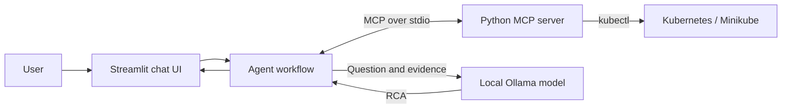

# MCP Kubernetes Troubleshooting Agent

A local application for inspecting Kubernetes and generating evidence-based root cause analysis (RCA). The Python MCP server exposes diagnostic tools backed by `kubectl`; the Streamlit client invokes them and uses local Ollama to explain failures.

## Projects

| Project | Purpose | Documentation |
| --- | --- | --- |
| `mcp-server` | Exposes host and Kubernetes diagnostics as MCP tools over stdio. | [MCP server guide](mcp-server/README.md) |
| `mcp-chat-ui` | Provides the chat UI, MCP orchestration, and Ollama RCA. | [Chat UI guide](mcp-chat-ui/README.md) |

## Architecture



The UI launches the MCP server as a child process; the server does not need an HTTP port. `kubectl` uses the same user and kubeconfig as Streamlit.

## Prerequisites

- Python 3.10 or newer.
- `kubectl` configured for the target cluster.
- A Kubernetes cluster. Minikube is optional; Docker is needed for its Docker driver.
- Ollama with the configured model downloaded and its local service running.
- Optional Node.js/npm for MCP Inspector.
- Optional supported GPU, drivers, and container runtime integration. The application itself does not require a GPU.

Check the core dependencies:

```bash
python --version
kubectl version --client
kubectl config current-context
ollama --version
```

## Setup and run

Run from the repository root. PowerShell users should use `.venv\\Scripts\\python.exe` where a command directly references `.venv/bin/python`.

```bash
python -m venv .venv
source .venv/bin/activate
python -m pip install --upgrade pip
python -m pip install -r mcp-server/requirements.txt
python -m pip install -r mcp-chat-ui/requirements.txt
ollama pull llama3.1:8b
```

Optional Minikube cluster:

```bash
minikube start --driver=docker --container-runtime=docker \
  --gpus=all --cpus=6 --memory=6144 --disk-size=40g \
  --profile=gpu-cpu-lab --nodes=3
kubectl config use-context gpu-cpu-lab
kubectl get nodes
```

Remove `--gpus=all` if GPU support is unavailable or unnecessary.

Set the application environment. Use an absolute server path:

```bash
export MCP_SERVER_COMMAND=python
export MCP_SERVER_PATH=/absolute/path/to/ts-mcp-k8s/mcp-server/server.py
export OLLAMA_MODEL=llama3.1:8b
streamlit run mcp-chat-ui/ui/app.py
```

PowerShell:

```powershell
$env:MCP_SERVER_COMMAND = "python"
$env:MCP_SERVER_PATH = (Resolve-Path ".\\mcp-server\\server.py")
$env:OLLAMA_MODEL = "llama3.1:8b"
streamlit run .\\mcp-chat-ui\\ui\\app.py
```

The code reads variables with `os.getenv` but does not automatically load `.env`. Export the file's values before starting Streamlit. Open the displayed URL, normally `http://localhost:8501`.

## How to test

### 1. Cluster access

```bash
kubectl get nodes
kubectl get pods -A
```

Both commands must work in the environment running the application.

### 2. MCP server

```bash
npx @modelcontextprotocol/inspector .venv/bin/python mcp-server/server.py
```

List the tools, then call `add`, `system_info`, `get_all_namespaces`, and `get_all_pods`.

### 3. Agent without Streamlit

```bash
cd mcp-chat-ui
python agent/agent.py
```

Enter `show all namespaces`. This tests the agent, stdio MCP process, and Kubernetes access without an Ollama request.

### 4. End-to-end UI

Start Streamlit and try:

- `show all namespaces`
- `why is my pod failing?`

Namespace questions return the namespace table. RCA questions inspect all pods; when an unhealthy pod is found, the agent collects its description, events, and logs before asking Ollama for an RCA. If all pods are healthy, it reports that no obvious failure was found.

## Security and limitations

- The server inherits current kubeconfig permissions; use a least-privilege identity outside a local cluster.
- Pod logs and diagnostic evidence are sent to the configured local Ollama service. Review them for secrets.
- Only the first unhealthy pod found is analyzed.
- Log retrieval does not select a container, which can affect multi-container pods.
- `disk_usage`, `memory_usage`, and `uptime` use Linux commands.
- Garbled icons visible in current UI source indicate an encoding issue; save those files as UTF-8 or replace the affected literals.

## Troubleshooting

- `kubectl command not found`: install it and ensure Streamlit inherits the correct `PATH`.
- MCP server not found: set `MCP_SERVER_PATH` to an absolute path.
- Ollama/model error: start Ollama and run `ollama pull <OLLAMA_MODEL>`.
- No failing pod detected: compare against `kubectl get pods -A` and the status rules in `mcp-chat-ui/agent/agent.py`.

