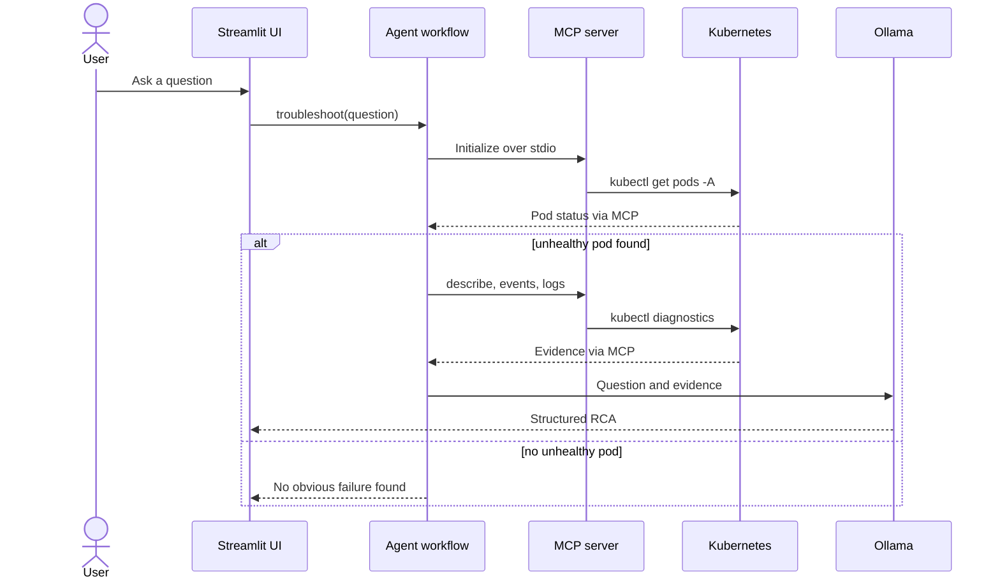

# MCP Kubernetes Chat UI

## Purpose

This project provides a ChatGPT-style Streamlit interface for Kubernetes diagnostics. The agent starts the sibling MCP server over stdio, calls its Kubernetes tools, detects the first unhealthy pod, gathers evidence, and asks a local Ollama model for a structured root cause analysis (RCA).

Namespace-list questions take a direct route and do not invoke Ollama.

## Diagram



## Project layout

- `ui/app.py`: Streamlit page, chat history, and progress display.
- `agent/agent.py`: question routing and RCA workflow.
- `agent/mcp_client.py`: stdio MCP connection and tool calls.
- `agent/llm.py`: Ollama prompt and RCA generation.
- `config/settings.py`: environment settings; it is not currently imported by the runtime workflow.

## Prerequisites

- Python 3.10+
- Packages from this project's and `../mcp-server/requirements.txt`
- The sibling `../mcp-server/server.py`
- `kubectl` on `PATH` with a working cluster context
- Ollama running with the selected model available
- Port 8501 available, or an alternative Streamlit port

## Configure and run

From the repository root:

```bash
python -m venv .venv
source .venv/bin/activate
python -m pip install -r mcp-server/requirements.txt
python -m pip install -r mcp-chat-ui/requirements.txt
ollama pull llama3.1:8b
export MCP_SERVER_COMMAND=python
export MCP_SERVER_PATH=/absolute/path/to/ts-mcp-k8s/mcp-server/server.py
export OLLAMA_MODEL=llama3.1:8b
streamlit run mcp-chat-ui/ui/app.py
```

PowerShell:

```powershell
$env:MCP_SERVER_COMMAND = "python"
$env:MCP_SERVER_PATH = (Resolve-Path ".\\mcp-server\\server.py")
$env:OLLAMA_MODEL = "llama3.1:8b"
streamlit run .\\mcp-chat-ui\\ui\\app.py
```

Use an absolute MCP server path. The application reads `os.getenv` but does not call `load_dotenv()`, so a root `.env` must be exported by the shell or launcher.

## How to test

### CLI smoke test

After setting the environment:

```bash
cd mcp-chat-ui
python agent/agent.py
```

Enter `show all namespaces`. Expect a heading and namespace table. This verifies imports, MCP startup, tool discovery, and cluster access without calling Ollama.

### UI smoke test

```bash
streamlit run mcp-chat-ui/ui/app.py
```

Open the displayed URL, submit `show all namespaces`, and confirm that the status panel completes and namespaces appear.

### RCA test

Submit `why is my pod failing?`.

- If all pods are healthy, expect a message that no obviously unhealthy pod was found.
- If a pod is unhealthy, expect calls to `get_all_pods`, `describe_pod`, `get_events`, and `pod_logs`, followed by an RCA containing Problem, Evidence, Root Cause, Confidence, Immediate Fix, Permanent Fix, and Prevention.

For a controlled test, use only a disposable/local cluster:

```bash
kubectl create deployment broken-demo --image=invalid.example/not-found:latest
kubectl get pods -w
```

After the pod reaches `ImagePullBackOff`, ask the RCA question. Clean up with:

```bash
kubectl delete deployment broken-demo
```

## Current limitations

- Only namespace-list questions have special intent routing; all other prompts use the RCA workflow.
- Only the first unhealthy pod is selected.
- Failure detection uses a fixed status set or a `READY` value beginning with `0/`.
- Large diagnostic output may exceed the selected model's practical context window.
- Some emoji literals in the current source display as mojibake and should be corrected using UTF-8 text.
