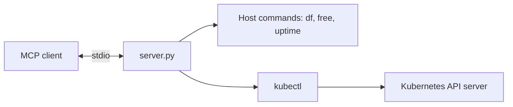

# MCP Server

## Purpose

`server.py` is a local Model Context Protocol server. It exposes Python functions as tools over standard input/output, allowing an MCP client to inspect the host and read Kubernetes state through `kubectl`.

## Diagram



## Prerequisites

- Python 3.10+
- Packages in `requirements.txt`
- `kubectl` on `PATH` with a valid kubeconfig/current context
- Linux/WSL for `df`, `free`, and `uptime`
- Optional Node.js/npm for MCP Inspector

## Available tools

| Tool | Purpose |
| --- | --- |
| `add` | Basic connectivity test that adds two integers. |
| `disk_usage`, `memory_usage`, `uptime` | Read host resource information. |
| `system_info` | Return a static health message. |
| `get_nodes_status`, `get_nodes` | List cluster nodes. |
| `get_all_namespaces` | List namespaces. |
| `get_all_pods`, `get_pods` | List pods cluster-wide or by namespace. |
| `describe_pod` | Describe a named pod. |
| `pod_logs` | Read recent logs for a pod. |
| `get_events` | Read time-sorted namespace events. |

## Install and run

```bash
python -m venv .venv
source .venv/bin/activate
python -m pip install -r mcp-server/requirements.txt
python mcp-server/server.py
```

The server waits for MCP messages on stdin, so direct execution may appear idle. Usually the chat client or Inspector starts it.

## How to test

```bash
kubectl get namespaces
kubectl get pods -A
npx @modelcontextprotocol/inspector .venv/bin/python mcp-server/server.py
```

In Inspector:

1. Call `add` with `{"a": 2, "b": 3}` and expect `5`.
2. Call `system_info` and expect the local server message.
3. Call `get_all_namespaces` and compare it with `kubectl get namespaces`.
4. Call `get_all_pods` and compare it with `kubectl get pods -A -o wide`.

On PowerShell use `.venv\\Scripts\\python.exe` instead of `.venv/bin/python`.

## Limitations

- Host commands are Linux-specific.
- Some helpers return an `ERROR:` string while others raise an exception.
- Tools use the current user's Kubernetes permissions.
- Pod logs do not support container selection or previous-container logs.
